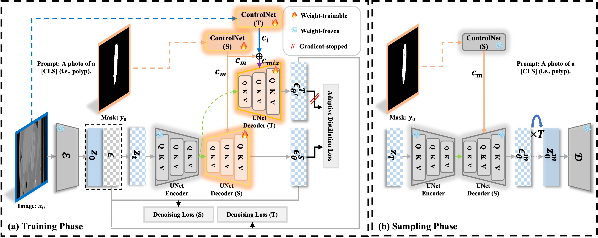

<div align="center">
<h1>Adaptively Distilled ControlNet: Accelerated Training and Superior Sampling for Medical Image Synthesis</h1>

[](https://arxiv.org/pdf/2507.23652)


</div>

<div align="center">

</div>

### 🚀 **Practical Examples**

#### Kidney Tumor Fast Convergence


### 🖼️ Visualization Results

#### Kidney Tumor Visualization


#### Polyp Visualization


### 🛠️ Requirements
The usual installation steps involve the following commands, they should set up the correct CUDA version and all the python packages:
```bash
conda create -n Siamese-Diffusion python=3.10
conda activate  Siamese-Diffusion
conda install pytorch==2.4.0 torchvision==0.19.0  pytorch-cuda=11.8 -c pytorch -c nvidia
pip install -U xformers --index-url https://download.pytorch.org/whl/cu118
pip install deepspeed
```

### 🗂️ Data and Structure
We evaluated our method on three public datasets: [Polyps](https://github.com/DengPingFan/PraNet) (as provided by the PraNet project), and [Kidney Tumor](https://github.com/neheller/kits19/).
```bash
--data
  --images
  --masks
  --prompt.json
```

### 🏋️‍♂️ Training
Here are example commands for training:
```bash
# Initialize ControlNet with the pretrained UNet encoder weights from Stable Diffusion,  
# then merge them with Stable Diffusion weights and save as: control_sd15.ckpt  
python tool_add_control.py

# For multi-GPU setups, ZeRO-2 can be used to train Siamese-Diffusion  
# to reduce memory consumption.  
python tutorial_train.py
```

### 🎨 Sampling
Here are example commands for sampling:
```bash
# ZeRO-2 distributed weights are saved under the folder:  
# lightning_logs/version_#/checkpoints/epoch/  
# Run the following commands to merge the weights:  
python . zero_to_fp32.py  
python tool_merge_control.py

# Sampling
python tutorial_inference.py
```

### 📣 Acknowledgements
This code is developed based on [ControlNet](https://github.com/lllyasviel/ControlNet) and incorporates several segmentation models, including [nnUNet](https://github.com/MIC-DKFZ/nnUNet), [SANet](https://github.com/weijun-arc/SANet), and [Polyp-PVT](https://github.com/DengPingFan/Polyp-PVT).

### 📖 Citation
If you find our work useful in your research or if you use parts of this code, please consider citing our paper:
```bash
@article{qiu2025adaptively,
  title={Adaptively Distilled ControlNet: Accelerated Training and Superior Sampling for Medical Image Synthesis},
  author={Qiu, Kunpeng and Zhou, Zhiying and Guo, Yongxin},
  journal={arXiv preprint arXiv:2507.23652},
  year={2025}
}
```

